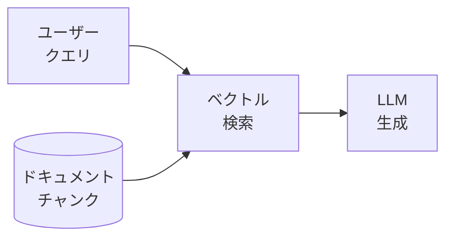
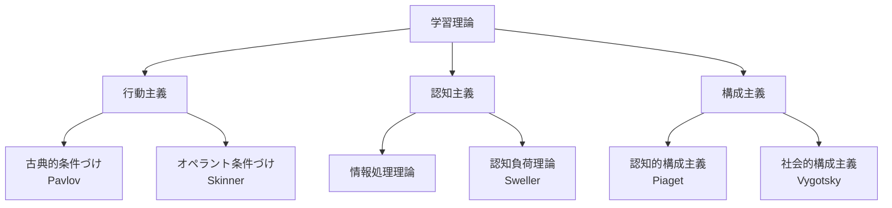
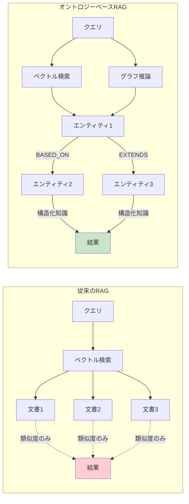
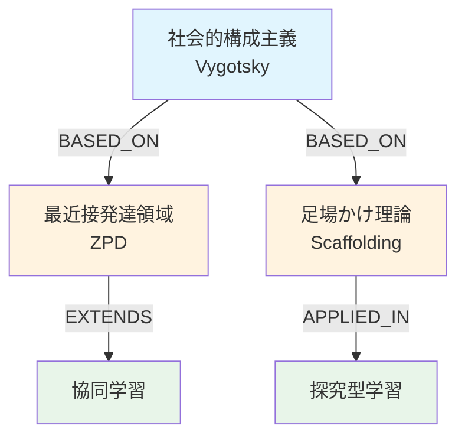
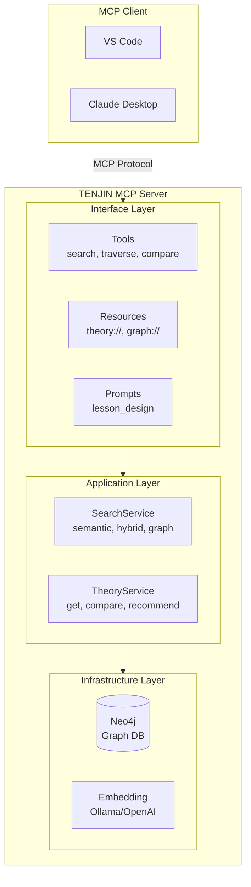
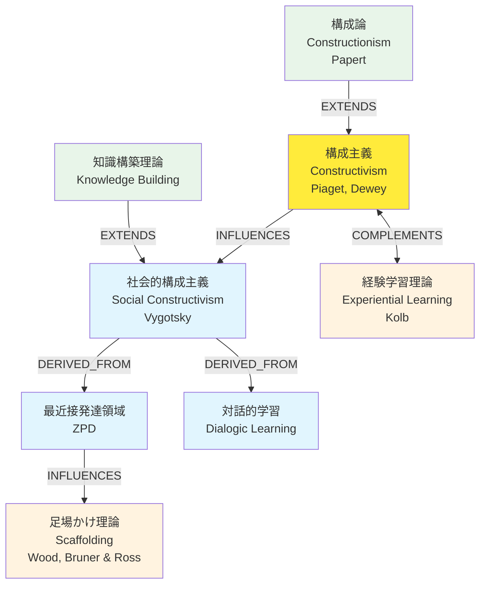
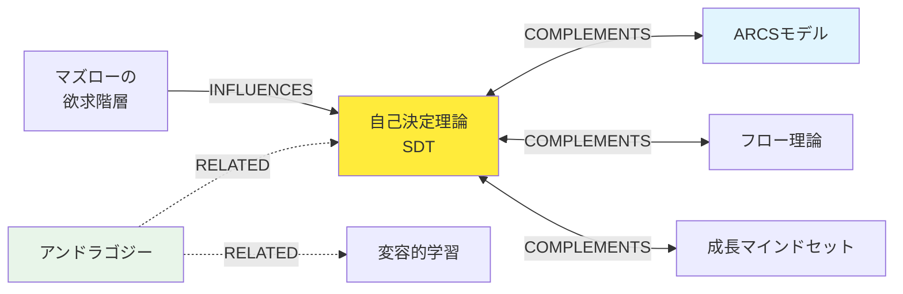
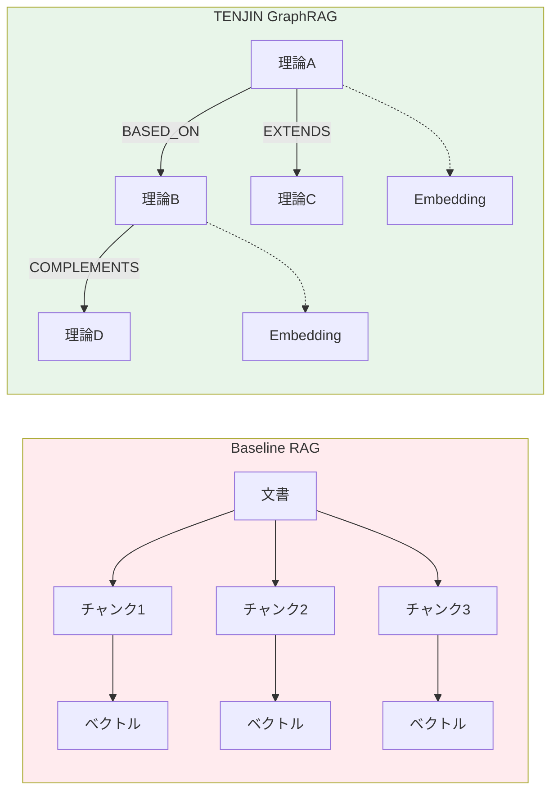
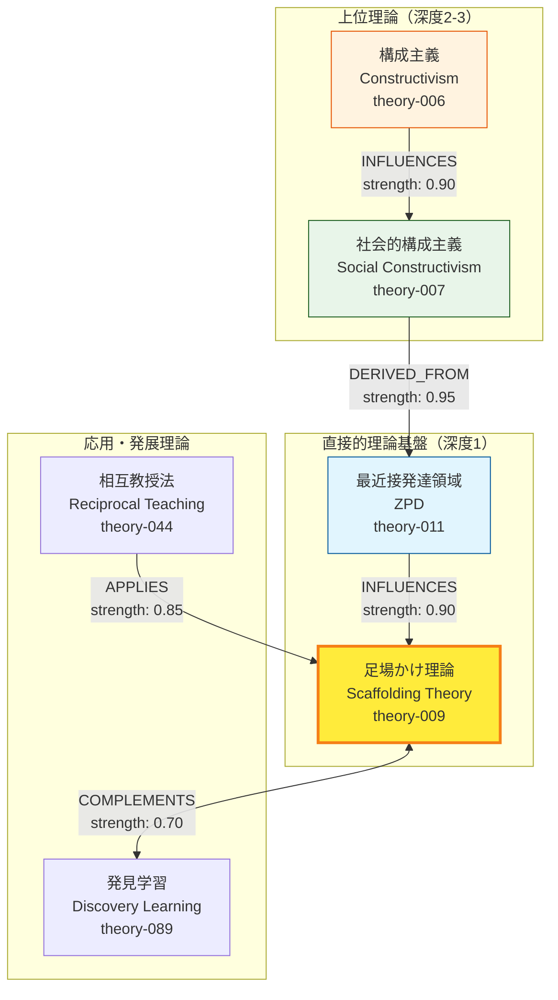
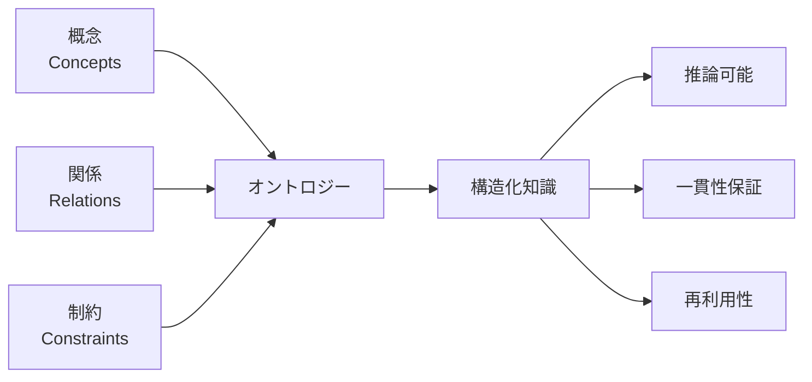

title: 「なぜその教育理論？」に答えられるAIへ ― TENJIN GraphRAGで実現するエビデンスベース教育支援

> **更新履歴**
> - 2025-12-28: v0.2.0 - 高度な推論機能（InferenceService）を追加
>   - 学習者プロファイルに基づく理論推薦
>   - 学習設計のギャップ分析
>   - 理論間の関係推論
>   - エビデンスに基づく推論
> - 2025-12-27: v0.1.0 - 初版リリース

# 第1章 はじめに

## 1.1 この記事の目的

「**足場かけ理論を使った授業設計をしてください**」

生成AIにこう尋ねたとき、あなたは満足のいく回答を得られましたか？

多くの場合、AIは「足場かけとは、学習者を支援し徐々に支援を減らしていく教授法です」といった**表面的な説明**にとどまります。しかし、教育者が本当に知りたいのは

- **なぜ**その理論が有効なのか？（理論的背景）
- **どの理論から**発展したのか？（系譜・関係性）
- **どんな原則**に基づいているのか？（実践指針）
- **誰が**提唱したのか？（出典・引用情報）

本記事では、これらの問いに答えられる**TENJIN GraphRAG**を紹介します。オントロジー工学に基づいて構築した教育理論のナレッジグラフにより、「**なぜその教育理論？**」という問いに、**エビデンスベースで回答できるAI**を実現します。

## 1.2 対象読者

| 読者 | 本記事で得られる知見 |
|------|---------------------|
| **教育系AIプロダクト開発者** | RAGの限界を超えるGraphRAGの設計パターン |
| **教育者・研究者** | AIを活用したエビデンスベース教育の可能性 |
| **LLMアプリケーション開発者** | オントロジー工学による知識構造化の実践例 |
| **ナレッジグラフ実践者** | MCP統合によるAIアシスタント拡張の実装例 |

## 1.3 TENJINとは

TENJIN（天神）は、**175以上の教育理論**をナレッジグラフ化し、Model Context Protocol（MCP）を通じてAIアシスタントに提供するGraphRAGシステムです。

```
「なぜその理論？」に答えられるAI
    ↓
教育理論の知識 × グラフ構造 × 生成AI = エビデンスベースの教育支援
```

**TENJINが解決する課題**：

| 従来のAIの問題 | TENJINの解決策 |
|---------------|---------------|
| 回答に根拠がない | ナレッジグラフから検証済み情報を取得 |
| 理論の誤解釈 | オントロジーで形式化された正確な定義 |
| 出典が不明確 | APA形式の引用を自動生成 |
| 関係性が見えない | グラフトラバースで系譜・関係を可視化 |
| 学習者に合った理論が不明 | 🆕 LLM推論による理論推薦 |
| 学習設計の改善点が不明 | 🆕 ギャップ分析による課題特定 |


# 第2章 なぜBaseline RAGでは不十分なのか

## 2.1 Baseline RAGの仕組み

従来のRAG（Retrieval-Augmented Generation）は、以下のシンプルな流れで動作します。



**処理フロー**:
1. ユーザーの質問をベクトル化
2. 類似度の高いテキストチャンクを検索
3. 検索結果をコンテキストとしてLLMに渡す
4. LLMが回答を生成

## 2.2 Baseline RAGの限界

### 限界1: 関係性の喪失

テキストをチャンク分割すると、**概念間の関係性が失われます**。

```
【元の文脈】
「Vygotskyの最近接発達領域（ZPD）理論に基づき、
Brunerは足場かけ（Scaffolding）の概念を発展させた」

【チャンク分割後】
チャンク1: "Vygotskyの最近接発達領域（ZPD）理論..."
チャンク2: "Brunerは足場かけ（Scaffolding）の概念を..."

→ 「基づき」「発展させた」という関係が切断される
```

### 限界2: 階層構造の無視

教育理論には明確な**階層構造**があります。



Baseline RAGはこの階層を平坦化し、「行動主義の中のオペラント条件づけ」という位置づけを理解できません。

### 限界3: 推論の欠如

Baseline RAGは**検索**はできますが、**推論**ができません。

| 能力 | Baseline RAG | GraphRAG |
|------|-------------|----------|
| 「構成主義とは？」 | ✅ 検索可能 | ✅ |
| 「構成主義の関連理論は？」 | ⚠️ 限定的 | ✅ グラフ探索 |
| 「A理論とB理論の関係は？」 | ❌ 不可能 | ✅ パス発見 |
| 「この文脈に適した理論は？」 | ❌ 不可能 | ✅ 推論可能 |


# 第3章 オントロジー工学とGraphRAG

## 3.1 オントロジー工学とは

### 3.1.1 オントロジーの定義と歴史

**オントロジー（Ontology）** とは、もともと哲学用語で「存在論」を意味しますが、情報科学では**ある領域の概念と概念間の関係を形式的に記述した知識表現**を指します。

> "An ontology is a formal, explicit specification of a shared conceptualization."
> （オントロジーとは、共有された概念化の形式的で明示的な仕様である）
> — Gruber (1993)

```
オントロジー = 概念（Concepts） + 関係（Relations） + 制約（Constraints） + 公理（Axioms）
```

### 3.1.2 オントロジーの構成要素

| 要素 | 説明 | 教育理論での例 |
|------|------|----------------|
| **クラス（Class）** | 概念のカテゴリ | Theory, Theorist, Principle |
| **インスタンス（Instance）** | 具体的な実体 | 足場かけ理論, Vygotsky |
| **プロパティ（Property）** | 属性・関係 | name, year, BASED_ON |
| **公理（Axiom）** | 論理的制約 | 理論は提唱者を持つ |

### 3.1.3 なぜ教育AIにオントロジーが必要か

従来のRAGシステムとオントロジーベースのシステムを比較すると



**オントロジーの利点**：

1. **明示的な関係**: 「AはBに基づく」などの関係が形式化
2. **推論可能**: グラフ構造を辿って未知の関係を発見
3. **一貫性**: 制約により矛盾した知識を排除
4. **再利用性**: 標準化された知識は他システムでも活用可能

### 3.1.4 教育理論オントロジーの設計原則

TENJINのオントロジーは以下の原則に基づいて設計されています。

| 原則 | 説明 | 実装例 |
|------|------|--------|
| **明確性** | 概念定義は曖昧さなく | 各理論にdescription_jaを付与 |
| **一貫性** | 矛盾する定義を排除 | 関係タイプの厳密な定義 |
| **拡張性** | 新概念追加が容易 | モジュラーなJSON構造 |
| **最小限の約束** | 必要最小限の制約 | 柔軟な関係強度(0.0-1.0) |

教育理論のオントロジーでは

- **概念**: Theory（理論）、Theorist（理論家）、Principle（原則）、Category（カテゴリ）
- **関係**: BASED_ON（基盤）、EXTENDS（発展）、CONTRASTS（対立）、COMPLEMENTS（補完）
- **制約**: 理論は必ず1つ以上のカテゴリに属する、関係には方向性がある、等

## 3.2 TENJINのオントロジー設計

TENJINでは、教育理論ドメインを以下のように構造化しています。

```cypher
// ノードタイプ（概念）
(:Theory)      // 教育理論
(:Theorist)    // 理論家
(:Category)    // カテゴリ
(:Principle)   // 原則・要素

// 関係タイプ
[:BASED_ON]      // A は B に基づく
[:EXTENDS]       // A は B を発展させた
[:CONTRASTS]     // A は B と対立する
[:COMPLEMENTS]   // A は B を補完する
[:DEVELOPED_BY]  // 理論の提唱者
[:BELONGS_TO]    // カテゴリ所属
[:HAS_PRINCIPLE] // 理論の原則
```

## 3.3 グラフ構造の威力

実際のナレッジグラフの一部を見てみましょう。



この構造により、「足場かけ理論」を検索すると、その**理論的基盤**（ZPD、社会的構成主義）と**応用先**（探究型学習）が自動的に関連付けられます。


# 第4章 TENJIN GraphRAGのアーキテクチャ

## 4.1 システム構成

TENJIN GraphRAGは、**クリーンアーキテクチャ**の原則に基づいて設計されています。システムは大きく3つの層（クライアント、MCPサーバー、インフラストラクチャ）で構成され、各層が明確な責務を持っています。

### アーキテクチャの特徴

| 層 | 責務 | 主要コンポーネント |
|----|------|-------------------|
| **クライアント層** | ユーザーインターフェース | VS Code, Claude Desktop |
| **インターフェース層** | MCP プロトコル処理 | Tools, Resources, Prompts |
| **アプリケーション層** | ビジネスロジック | SearchService, TheoryService |
| **インフラストラクチャ層** | データ永続化・外部サービス | Neo4j, Embedding Model |



### 各層の詳細

#### クライアント層（MCP Client）
MCPプロトコルに対応した任意のクライアントからTENJINを利用できます。現在サポートしている主要なクライアントは：

- **VS Code**: GitHub Copilot Chat経由での利用。開発者が教育コンテンツを作成する際に活用
- **Claude Desktop**: チャット形式での対話的な教育理論の探索・学習

#### インターフェース層（Interface Layer）
MCPプロトコルの3つのプリミティブを実装しています：

- **Tools**: `search_theories`, `traverse_graph`, `compare_theories`など、AIが呼び出し可能な関数
- **Resources**: `theory://`や`graph://`スキームでの理論データへの直接アクセス
- **Prompts**: `lesson_design`など、教育現場向けの定型プロンプトテンプレート

#### アプリケーション層（Application Layer）
ドメインロジックを実装するサービス群です：

- **SearchService**: セマンティック検索、ハイブリッド検索、グラフトラバースを統合
- **TheoryService**: 理論の取得、比較、推薦などの高レベル操作を提供

#### インフラストラクチャ層（Infrastructure Layer）
外部サービスとの統合を担当します：

- **Neo4j**: 教育理論のナレッジグラフを格納。Cypherクエリによる柔軟なグラフ操作
- **Embedding Model**: esperantoライブラリ経由でOllama/OpenAIなど複数のモデルを切り替え可能

## 4.2 ハイブリッド検索

TENJINは3種類の検索を組み合わせた**ハイブリッド検索**を実装しています。

```python
# 1. セマンティック検索（ベクトル類似度）
semantic_results = await embedding_search(query, top_k=10)

# 2. グラフトラバース（関係性探索）
graph_results = await traverse_graph(
    start_node=semantic_results[0],
    depth=2,
    relation_types=["BASED_ON", "EXTENDS", "COMPLEMENTS"]
)

# 3. キーワード検索（補完）
keyword_results = await keyword_search(query, fields=["name_ja", "key_principles"])

# 統合・リランキング
final_results = merge_and_rerank(
    semantic_results,
    graph_results,
    keyword_results
)
```

## 4.3 MCPツール

TENJINが提供する主要なMCPツール：

| ツール名 | 機能 | 使用例 |
|---------|------|--------|
| `search_theories` | 理論検索 | 「認知負荷に関する理論を検索」 |
| `get_theory` | 理論詳細取得 | 「構成主義の詳細を教えて」 |
| `traverse_graph` | グラフ探索 | 「足場かけ理論の関連理論は？」 |
| `compare_theories` | 理論比較 | 「行動主義と構成主義の違いは？」 |
| `cite_theory` | 引用生成 | 「APA形式で引用を生成」 |


# 第5章 GraphRAGで「何ができるようになるか」

TENJIN GraphRAGは、教育理論のナレッジグラフを活用することで、従来のAIでは実現できなかった**構造化された知識に基づく支援**を提供します。本章では、4つの代表的なユースケースを通じて、GraphRAGの実践的な価値を示します。

| ユースケース | 解決する課題 | GraphRAGの強み |
|--------------|--------------|----------------|
| 理論に基づいた授業設計 | 経験則に頼った設計 | 複数理論の統合と参考文献の自動付与 |
| 理論間の関係理解 | 孤立した知識の断片化 | グラフトラバースによる系譜可視化 |
| 文脈に応じた理論推薦 | 状況に適した理論の選定困難 | 文脈分析と多理論の優先度付き推薦 |
| 引用生成 | 正確な引用情報の取得 | APA形式での一次文献自動生成 |

## 5.1 ユースケース1: 理論に基づいた授業設計

教育現場で最も頻繁に発生する課題の一つが、**理論的根拠に基づいた授業設計**です。多くの教員は経験則に頼りがちですが、エビデンスベースの教育には理論的基盤が不可欠です。

**従来のAIの限界**：
- 一般的なアドバイスにとどまり、具体的な理論名や提唱者が示されない
- 参考文献が生成されないため、信頼性の検証が困難
- 複数の理論を統合した設計ができない

**TENJIN GraphRAGの解決策**：
- ナレッジグラフから関連する複数の理論を検索・統合
- 各理論の主要原則と具体的な適用方法を提示
- APA形式の参考文献を自動生成し、学術的信頼性を担保

### Before（従来のAI）

```
Q: 小学4年生の社会科で探究型学習を取り入れた授業を設計してください

A: 探究型学習では、児童が自ら問いを立て、調べ、まとめる活動が
   重要です。以下のような流れで進めましょう...
   （経験則的なアドバイス、理論的根拠なし）
```

### After（TENJIN GraphRAG）

```
Q: @tengin-graphrag 小学4年生の社会科で探究型学習を取り入れた授業を設計してください

A: 探究型学習に関連する教育理論をナレッジグラフから検索しました。
   以下の理論を組み合わせた授業設計を提案します。

   【理論的基盤】
   
   1. 経験学習理論（Experiential Learning）- Kolb (1984)
      4段階サイクル:
      - 具体的経験（Concrete Experience）
      - 内省的観察（Reflective Observation）
      - 抽象的概念化（Abstract Conceptualization）
      - 能動的実験（Active Experimentation）
   
   2. スキャフォールディング理論 - Wood, Bruner & Ross (1976)
      主要原則:
      - 学習者の現在レベルに合わせた支援
      - 能力向上に応じて支援を徐々に減らす（フェーディング）
      - 課題を管理可能な要素に分解
      - 最近接発達領域（ZPD）をターゲット
   
   3. 認知発達理論 - Piaget
      - 小学4年生は具体的操作期（7-11歳）
      - 具体的な事物を使った論理的思考が可能
      - 抽象的な概念は具体物と結びつけて理解

   【授業設計：「校区の安全を調べよう」】
   
   | 時数 | 段階 | 活動 | 足場かけ |
   |------|------|------|----------|
   | 第1時 | Engage | 交通安全マップを見て気づきを共有 | 観察ワークシート |
   | 第2時 | Explore | グループで校区を歩き危険箇所を調査 | 調査チェックリスト |
   | 第3時 | Explain | 調査結果を整理しなぜ危険かを考える | 分析フレームワーク |
   | 第4時 | Elaborate | 改善案を考え安全マップを作成 | 地図テンプレート |
   | 第5時 | Evaluate | 発表・振り返り | ルーブリック |

   【参考文献】
   - Kolb, D. A. (1984). Experiential learning: Experience as the 
     source of learning and development. Prentice-Hall.
   - Wood, D., Bruner, J. S., & Ross, G. (1976). The role of tutoring 
     in problem solving. Journal of Child Psychology and Psychiatry, 
     17(2), 89-100.
```

## 5.2 ユースケース2: 理論間の関係理解

教育理論は孤立して存在するわけではありません。各理論は他の理論から**影響を受け、発展し、時に対立**しながら、複雑なネットワークを形成しています。この関係性を理解することは、理論の本質を把握する上で極めて重要です。

**従来の学習方法の限界**：
- 教科書では個々の理論が独立して説明され、関係性が見えにくい
- 理論の歴史的発展や系譜を追跡するには多くの文献を横断する必要がある
- 初学者にとって、どの理論から学べばよいか判断が難しい

**TENJIN GraphRAGの解決策**：
- **グラフトラバース**機能により、任意の理論を起点に関連理論を自動探索
- 関係タイプ（INFLUENCES, EXTENDS, CONTRASTS, COMPLEMENTS）を明示
- Mermaid図による視覚的な系譜表示で、理論間の位置関係を直感的に把握

### グラフトラバースの実際

```
Q: @tengin-graphrag 構成主義から派生した理論と、その関係を教えてください

A: 構成主義を起点にグラフを探索しました（深度2）：

   【起点ノード】
   構成主義 (Constructivism) - Piaget, Dewey
   「学習者は受動的に知識を受け取るのではなく、経験を通じて
    能動的に知識を構築する」

   【直接関係（深度1）】
   
   1. 構成主義 --INFLUENCES--> 社会的構成主義 (Vygotsky)
      拡張点: 社会的相互作用と文化的文脈を追加
   
   2. 構成主義 <--COMPLEMENTS--> 経験学習理論 (Kolb)
      補完関係: 経験を通じた学習という共通基盤
   
   3. 構成主義 <--EXTENDS-- 構成論 (Papert)
      発展: 「作ることによる学び」への拡張

   【間接関係（深度2）】
   
   4. 社会的構成主義 --DERIVED_FROM--> 最近接発達領域 (ZPD)
   5. 社会的構成主義 --DERIVED_FROM--> 対話的学習
   6. 社会的構成主義 <--EXTENDS-- 知識構築理論
   7. ZPD --INFLUENCES--> 足場かけ理論 (Scaffolding)
```



**【関係タイプの凡例】**
| 関係タイプ | 意味 | 例 |
|-----------|------|-----|
| INFLUENCES | 理論的影響を与えた | 構成主義 → 社会的構成主義 |
| EXTENDS | 理論を発展・拡張した | 構成論 → 構成主義 |
| DERIVED_FROM | 理論から派生した | 社会的構成主義 → ZPD |
| COMPLEMENTS | 相互に補完する | 構成主義 ↔ 経験学習理論 |

## 5.3 ユースケース3: 文脈に応じた理論推薦

教育現場では、**特定の状況に対してどの理論を適用すべきか**という判断が求められます。175の教育理論から最適なものを選ぶことは、専門家でも容易ではありません。

**従来のアプローチの限界**：
- 教員が知っている理論の範囲内でしか対処できない
- 複数の理論を組み合わせた多角的なアプローチが困難
- 理論選択の根拠が不明確で、再現性がない

**TENJIN GraphRAGの解決策**：
- **文脈分析**：環境（オンライン/対面）、課題（動機づけ/理解度）、対象者（年齢/背景）を解析
- **多理論推薦**：関連する複数の理論を優先度付きで提示
- **統合的提案**：理論間の関係をグラフ探索し、相互補完的な解決策を提示
- **実践的改善策**：各理論から導かれる具体的なアクションを表形式で整理

```
Q: @tengin-graphrag 大学のオンライン授業で学生の動機づけが低下しています。
   適切な理論を推薦してください。

A: 文脈を分析しました：
   - 環境: オンライン授業（大学）
   - 課題: 学生の動機づけ低下
   - 対象: 大学生（成人学習者）

   【推薦理論】優先度順
   
   1. 自己決定理論 (Self-Determination Theory) - Deci & Ryan (1985)
      適合理由: 動機づけの質に焦点を当てた包括的フレームワーク
      
      3つの基本的心理欲求:
      | 欲求 | 説明 | オンラインでの対策 |
      |------|------|-------------------|
      | 自律性 | 自分で選択・決定できる感覚 | 課題の選択肢提供、学習ペースの自由 |
      | 有能感 | できるという実感 | 即時フィードバック、段階的な達成感 |
      | 関係性 | 他者とのつながり | グループワーク、ピア評価 |
   
   2. ARCSモデル - John M. Keller (1979)
      適合理由: 動機づけ設計に特化したインストラクショナルデザインモデル
      
      4要素:
      - Attention（注意）: 動画・インタラクティブコンテンツ
      - Relevance（関連性）: キャリアとの接続、実務事例
      - Confidence（自信）: 明確な目標、スモールステップ
      - Satisfaction（満足感）: 達成感、認証バッジ
   
   3. アンドラゴジー (Andragogy) - Malcolm Knowles (1984)
      適合理由: 大学生は成人学習者として扱うべき
      
      6つの前提:
      - 知る必要性 → 学習目的の明確化
      - 経験の活用 → ディスカッション・事例共有
      - 自己主導性 → 学習計画への参画
      - レディネス → 即座に役立つ内容
      - 問題中心 → PBL・ケーススタディ
      - 内発的動機 → 興味・関心を軸に設計
   
   4. 探究コミュニティ (Community of Inquiry) - Garrison et al. (2000)
      適合理由: オンライン学習環境に特化したフレームワーク
      
      3つのプレゼンス:
      - ソーシャルプレゼンス: 感情表現・グループ凝集性
      - 認知的プレゼンス: 探究・統合・解決
      - 教授プレゼンス: 設計・ファシリテーション

   【理論間の関係（グラフ探索結果）】
```



```
   【具体的な授業改善策】
   
   | 課題 | 理論的根拠 | 改善策 |
   |------|-----------|--------|
   | 孤立感 | CoI（ソーシャルプレゼンス）、SDT（関係性） | ブレイクアウトルーム、ピア学習 |
   | 意味の喪失 | ARCS（関連性）、アンドラゴジー | キャリアとの接続、実務家ゲスト |
   | 自信低下 | SDT（有能感）、ARCS（自信） | 形成的評価、小さな成功体験 |
   | 受動的参加 | アンドラゴジー（自己主導性）、SDT（自律性） | 選択課題、学習契約 |

   【参考文献】
   - Deci, E. L., & Ryan, R. M. (1985). Intrinsic motivation and 
     self-determination in human behavior. Plenum Press.
   - Keller, J. M. (1987). Development and use of the ARCS model of 
     instructional design. Journal of Instructional Development, 10(3), 2-10.
   - Knowles, M. S. (1984). Andragogy in action. Jossey-Bass.
   - Garrison, D. R., Anderson, T., & Archer, W. (2000). Critical inquiry 
     in a text-based environment. The Internet and Higher Education, 2(2-3), 87-105.
```

## 5.4 ユースケース4: 引用生成

学術論文や研修資料を作成する際、**正確な引用情報**は不可欠です。しかし、一次文献を特定し、正しい形式で引用を作成することは時間のかかる作業です。

**従来の問題点**：
- 一般的なLLMは引用情報を「幻覚（ハルシネーション）」として生成するリスクがある
- DOI（デジタルオブジェクト識別子）が不正確または存在しない場合がある
- 理論の提唱者や発表年が誤って生成されることがある

**TENJIN GraphRAGの解決策**：
- ナレッジグラフに格納された**検証済みの文献情報**を使用
- 一次文献（原著論文）、レビュー論文、書籍を区別して提示
- **DOIリンク付き**のAPA形式引用を自動生成
- 理論の概要、主要原則、3種類の認知負荷などの構造化情報も同時に提供

```
Q: @tengin-graphrag 認知負荷理論についてAPA形式で引用を生成してください

A: 認知負荷理論 (Cognitive Load Theory) - theory-004

   【理論概要】
   提唱者: John Sweller
   カテゴリ: 学習理論 (Learning Theory)
   
   ジョン・スウェラーの認知負荷理論は、学習中の脳が情報をどのように
   処理するかを説明し、3種類の認知負荷を識別します。

   【3種類の認知負荷】
   | 負荷タイプ | 英語名 | 説明 | 対策 |
   |-----------|--------|------|------|
   | 内在的負荷 | Intrinsic Load | 学習内容自体の複雑さ | 適切な順序立て |
   | 外在的負荷 | Extraneous Load | 不適切な教材設計 | 冗長性排除 |
   | 本質的負荷 | Germane Load | スキーマ構築に必要 | 可変練習促進 |

   【主要原則（Key Principles）】
   - ワーキングメモリの容量には限界がある
   - 内在的負荷は課題の複雑さと事前知識に依存
   - 外在的負荷はインストラクショナルデザインで最小化すべき
   - 本質的負荷はスキーマ構築を促進する

   【APA形式引用 - 一次文献】
   
   Sweller, J. (1988). Cognitive load during problem solving: Effects 
       on learning. Cognitive Science, 12(2), 257-285. 
       https://doi.org/10.1207/s15516709cog1202_4

   Sweller, J. (1994). Cognitive load theory, learning difficulty, and 
       instructional design. Learning and Instruction, 4(4), 295-312. 
       https://doi.org/10.1016/0959-4752(94)90003-5

   Sweller, J., van Merriënboer, J. J. G., & Paas, F. G. W. C. (1998). 
       Cognitive architecture and instructional design. Educational 
       Psychology Review, 10(3), 251-296. 
       https://doi.org/10.1023/A:1022193728205

   【20年後レビュー論文】
   
   Sweller, J., van Merriënboer, J. J. G., & Paas, F. (2019). Cognitive 
       architecture and instructional design: 20 years later. Educational 
       Psychology Review, 31(2), 261-292. 
       https://doi.org/10.1007/s10648-019-09465-5

   【書籍】
   
   Sweller, J., Ayres, P., & Kalyuga, S. (2011). Cognitive load theory. 
       Springer. https://doi.org/10.1007/978-1-4419-8126-4

   Plass, J. L., Moreno, R., & Brünken, R. (Eds.). (2010). Cognitive 
       load theory. Cambridge University Press.

   【応用分野】
   - インストラクショナルデザインの最適化
   - マルチメディア学習教材の開発
   - 複雑な問題解決の指導
```


# 第6章 技術的な差別化ポイント

本章では、TENJIN GraphRAGが従来のRAGシステムと比較してどのような技術的優位性を持つのかを、**アーキテクチャ**、**精度**、**パフォーマンス**の3つの観点から詳細に分析します。これらの差別化ポイントは、教育分野における生成AIの実用性を大きく向上させる鍵となります。

## 6.1 Baseline RAG vs TENJIN GraphRAG 比較表

まず、アーキテクチャレベルでの根本的な違いを整理します。Baseline RAGは「文書をチャンクに分割してベクトル化する」というシンプルなアプローチを採用していますが、TENJIN GraphRAGは**オントロジー工学に基づいた構造化知識**を活用しています。

**アーキテクチャの本質的な違い**：



| 観点 | Baseline RAG | TENJIN GraphRAG |
|------|-------------|-----------------|
| **データ構造** | フラットなチャンク | 階層的ナレッジグラフ |
| **検索方式** | ベクトル類似度のみ | ハイブリッド（セマンティック+グラフ+キーワード） |
| **関係性** | 暗黙的（テキスト内） | 明示的（エッジとして定義） |
| **推論能力** | なし | グラフトラバースによる推論 |
| **文脈理解** | チャンク単位 | ドメイン全体のオントロジー |
| **出典管理** | 手動 | 自動引用生成 |
| **スケーラビリティ** | ドキュメント追加のみ | オントロジー拡張可能 |

**各観点の詳細解説**：

| 観点 | 詳細説明 |
|------|----------|
| **データ構造** | Baseline RAGは文書を固定長のチャンクに分割するため、概念間の関係が断片化します。GraphRAGはノード（概念）とエッジ（関係）として知識を保持し、構造を維持します。 |
| **検索方式** | ベクトル類似度だけでは「似ている」ことしかわかりません。GraphRAGは類似度に加えて、「影響を与えた」「発展させた」などの意味的関係を活用します。 |
| **推論能力** | Baseline RAGは検索結果を並べるだけですが、GraphRAGはグラフを辿って「AがBに影響し、BがCに発展した」という推論チェーンを構築できます。 |

## 6.2 精度比較（定性評価）

技術的な差異が実際の回答品質にどう影響するかを、具体的なクエリを使って検証します。以下の比較では、**理論的背景の説明**という、教育分野で最も重要な機能に焦点を当てています。

**評価観点**：
1. **正確性**: 理論の定義、提唱者、年代が正しいか
2. **完全性**: 理論的背景、関連理論が網羅されているか
3. **構造性**: 情報が整理されて提示されているか
4. **追跡可能性**: 参考文献により検証可能か

実際のクエリでの回答品質比較：

```
【クエリ】「足場かけ理論とは何か、その理論的背景も含めて説明してください」

【Baseline RAG の回答】
足場かけ（Scaffolding）とは、学習者が課題を達成できるよう
教師が一時的な支援を提供し、徐々に支援を減らしていく教授法です。
（理論的背景の説明が不足、または不正確）
```

### TENJIN GraphRAG の回答

**足場かけ理論（Scaffolding Theory）** - theory-009

| 項目 | 内容 |
|------|------|
| 英語名 | Scaffolding Theory |
| 日本語名 | スキャフォールディング理論 |
| カテゴリ | 学習理論（learning_theory） |
| 提唱者 | Jerome Bruner, David Wood, Gail Ross (1976) |

足場かけ理論は、ジェローム・ブルーナー、デイビッド・ウッド、ゲイル・ロスがヴィゴツキーのZPD概念を基に開発したもので、**学習者が新しいスキルを発達させる際に一時的な支援を提供するプロセス**を説明します。

#### 理論的背景（グラフトラバース結果 - 深度3）



**【理論系譜表（relationships.jsonより）】**

| 深度 | 理論 | 関係タイプ | 強度 | 説明 |
|------|------|-----------|------|------|
| 3 | 構成主義 (theory-006) | INFLUENCES | 0.90 | 社会的構成主義の基盤 |
| 2 | 社会的構成主義 (theory-007) | DERIVED_FROM | 0.95 | ZPDの母体理論 |
| 1 | 最近接発達領域 ZPD (theory-011) | INFLUENCES | 0.90 | 足場かけ理論に直接影響 |
| **0** | **足場かけ理論 (theory-009)** | - | - | **現在のノード** |
| 1 | 相互教授法 (theory-044) | APPLIES | 0.85 | 足場かけを応用 |

**【主要原則（theories.json key_principlesより）】**

| # | 原則 | 英語原文 |
|---|------|----------|
| 1 | レベル適応支援 | Support is calibrated to the learner's current level of competence |
| 2 | フェーディング | Assistance is gradually withdrawn as competence increases |
| 3 | タスク分解 | Tasks are broken into manageable components |
| 4 | モデリング先行 | Modeling and demonstration precede independent practice |
| 5 | ZPDターゲット | Scaffolding targets the Zone of Proximal Development |
| 6 | 責任移譲 | Transfer of responsibility occurs from teacher to learner |

**【参考文献（APA形式）】**

Wood, D., Bruner, J. S., & Ross, G. (1976). The role of tutoring in problem 
    solving. *Journal of Child Psychology and Psychiatry, 17*(2), 89-100. 
    https://doi.org/10.1111/j.1469-7610.1976.tb00381.x

Vygotsky, L. S. (1978). *Mind in society: The development of higher 
    psychological processes*. Harvard University Press.

### 比較まとめ

| 観点 | Baseline RAG | TENJIN GraphRAG |
|------|-------------|-----------------|
| 理論の定義 | ✅ 基本的な説明 | ✅ 詳細な説明 + 日英対応 |
| 提唱者 | ❌ 不明確 | ✅ Wood, Bruner & Ross (1976) |
| 理論的背景 | ❌ 欠落 | ✅ 3階層のグラフ探索で特定 |
| 関連理論 | ❌ なし | ✅ ZPD, 社会的構成主義, 構成主義 |
| 関係の強度 | ❌ 不明 | ✅ 0.90〜0.95（定量的） |
| 主要原則 | ⚠️ 1-2個 | ✅ 6個（構造化） |
| 引用情報 | ❌ なし | ✅ APA形式で自動生成 |

## 6.3 パフォーマンス特性

GraphRAGはオントロジーを活用するため、「複雑で遅いのでは？」という懸念があるかもしれません。しかし、TENJIN GraphRAGは**効率的なインデックス設計**と**キャッシュ戦略**により、実用的なレスポンス時間を実現しています。

**パフォーマンス最適化のポイント**：

| 最適化項目 | 手法 | 効果 |
|-----------|------|------|
| **グラフインデックス** | Neo4jのネイティブグラフストレージ | O(1)でのノード隣接探索 |
| **ベクトルインデックス** | HNSW（Hierarchical Navigable Small World） | 高速な近似最近傍探索 |
| **ハイブリッド実行** | セマンティック検索とグラフ探索の並列実行 | レイテンシの最小化 |
| **結果キャッシュ** | 頻出クエリパターンのキャッシュ | 繰り返しクエリの高速化 |

**現在のシステム規模と性能指標**：

| 指標 | 数値 |
|------|------|
| 理論数 | 175+ |
| 関係数 | 342+ |
| 平均検索時間 | < 500ms |
| グラフトラバース（深度2） | < 200ms |
| Embedding次元 | 768（nomic-embed-text） |


# 第7章 導入方法

TENJIN GraphRAGは、**オープンソース**として公開されており、誰でも自由に利用・カスタマイズできます。本章では、開発環境のセットアップからVS Codeでの利用開始まで、ステップバイステップで説明します。

**必要な前提条件**：

| 項目 | 要件 | 用途 |
|------|------|------|
| **Python** | 3.11以上 | MCPサーバー実行 |
| **Docker** | 最新版推奨 | Neo4jコンテナ |
| **VS Code** | 最新版 | MCP クライアント |
| **uv** | 最新版 | Python依存関係管理 |

## 7.1 クイックスタート

最短5分でTENJIN GraphRAGを起動できます。以下の手順は、Docker環境が既にインストールされていることを前提としています。

**セットアップの流れ**：


```bash
# 1. リポジトリをクローン
git clone https://github.com/nahisaho/TENJIN.git
cd TENJIN

# 2. Neo4jを起動
docker-compose up -d neo4j

# 3. 依存関係をインストール
pip install uv && uv sync

# 4. データをロード（175の教育理論）
uv run python -m scripts.load_data
```

**各ステップの詳細**：

| ステップ | 所要時間 | 説明 |
|----------|----------|------|
| 1. Clone | 〜30秒 | GitHubからソースコードを取得 |
| 2. Neo4j起動 | 〜1分 | グラフデータベースをDockerで起動 |
| 3. 依存関係 | 〜2分 | Python パッケージをuvでインストール |
| 4. データロード | 〜1分 | 175の教育理論と77の関係をNeo4jに投入 |

:::note info
**トラブルシューティング**: Neo4jの起動に失敗する場合は、ポート7687と7474が使用されていないことを確認してください。
:::

## 7.2 VS Codeでの利用

VS CodeでTENJIN GraphRAGを利用するには、**MCP（Model Context Protocol）サーバー**として設定します。GitHub Copilot Chatから直接教育理論を検索・探索できるようになります。

**設定ファイルの配置**：

```
プロジェクトルート/
├── .vscode/
│   └── mcp.json    ← この設定ファイルを作成
└── ...
```

`.vscode/mcp.json` を設定：

```json
{
  "servers": {
    "tenjin": {
      "type": "stdio",
      "command": "uv",
      "args": ["run", "tengin-server"],
      "env": {
        "NEO4J_URI": "bolt://localhost:7687",
        "EMBEDDING_PROVIDER": "ollama",
        "EMBEDDING_MODEL": "nomic-embed-text"
      }
    }
  }
}
```

**設定項目の説明**：

| 項目 | 説明 | 選択肢 |
|------|------|--------|
| `NEO4J_URI` | Neo4jの接続先 | デフォルト: `bolt://localhost:7687` |
| `EMBEDDING_PROVIDER` | Embeddingプロバイダー | `ollama`, `openai`, `azure` |
| `EMBEDDING_MODEL` | 使用するモデル | Ollama: `nomic-embed-text`<br>OpenAI: `text-embedding-3-small` |

### Embeddingプロバイダーの詳細設定

Embeddingプロバイダーは**2つの方法**で設定できます。

#### 方法1: `.vscode/mcp.json`で設定（VS Code用）

上記の設定ファイルの`env`セクションで指定します。VS Code内でのみ有効です。

#### 方法2: `.env`ファイルで設定（グローバル設定）

プロジェクトルートの`.env`ファイルで設定します。すべての実行環境で有効です。

```bash
# .env.exampleをコピーして.envを作成
cp .env.example .env
```

**`.env`ファイルの設定例**：

```dotenv
# Ollama使用時（ローカル、無料）
EMBEDDING_PROVIDER=ollama
EMBEDDING_MODEL=nomic-embed-text
OLLAMA_HOST=http://localhost:11434

# OpenAI使用時（クラウド、有料）
# EMBEDDING_PROVIDER=openai
# EMBEDDING_MODEL=text-embedding-3-small
# OPENAI_API_KEY=sk-your-openai-key
```

**プロバイダー別の設定**：

| プロバイダー | 必要な設定 | 特徴 |
|-------------|-----------|------|
| **Ollama** | `OLLAMA_HOST`（デフォルト: localhost:11434） | 無料、ローカル実行、プライバシー保護 |
| **OpenAI** | `OPENAI_API_KEY` | 高精度、クラウド、従量課金 |
| **Azure OpenAI** | `AZURE_OPENAI_ENDPOINT`, `AZURE_OPENAI_KEY` | エンタープライズ向け、SLA保証 |

:::note info
**Ollamaのセットアップ**: Ollamaを使用する場合は、事前に`ollama pull nomic-embed-text`でモデルをダウンロードしてください。
:::

:::note warn
**Embeddingプロバイダーについて**: ローカル環境ではOllamaを推奨します。OpenAIを使用する場合は`OPENAI_API_KEY`環境変数の設定が必要です。
:::

**Copilot Chatでの使用例**：

Copilot Chatで使用：

```
@tengin-graphrag 認知負荷理論について教えてください
```

設定が正しく完了していれば、`@tengin-graphrag`と入力した時点でTENJINサーバーが候補として表示されます。

## 7.3 Theory Editor

TENJIN GraphRAGには、教育理論データを**視覚的に編集・拡張**できるWebベースのツール「Theory Editor」が付属しています。プログラミング知識がなくても、新しい理論の追加や関係の編集が可能です。

**Theory Editorの機能**：

| 機能 | 説明 |
|------|------|
| **理論の閲覧** | 175の教育理論をカテゴリ別に一覧表示 |
| **理論の追加** | フォーム入力で新しい理論を追加 |
| **関係の編集** | 理論間の関係（BASED_ON, EXTENDS等）を視覚的に編集 |
| **JSON出力** | 編集結果をJSON形式でエクスポート |

教育理論データを編集・拡張するWebツールも提供：

```bash
cd tools/theory-editor
python -m http.server 8080
# http://localhost:8080 でアクセス
```

**Theory Editorの画面構成**：


:::note info
**コントリビューション**: Theory Editorで追加・編集した理論は、Pull Requestとしてコミュニティに貢献できます。詳細は[CONTRIBUTING.md](../../CONTRIBUTING.md)を参照してください。
:::


# 第8章 今後の展望

## 8.1 ロードマップ

| フェーズ | 内容 | 状態 |
|---------|------|------|
| Phase 1 | 基盤構築（175理論、MCP統合） | ✅ 完了 |
| Phase 2 | 推論機能強化（ギャップ分析、関係推論、理論推薦） | 🚧 開発中 |
| Phase 3 | マルチモーダル対応（図解自動生成） | 📋 計画中 |
| Phase 4 | コミュニティ拡張（理論追加API） | 📋 計画中 |

## 8.2 コントリビューション歓迎

- 新しい教育理論の追加
- 理論間関係の拡充
- 多言語対応（英語、中国語等）
- 他分野へのオントロジー拡張


# 第9章 まとめ

本記事では、教育分野における生成AIの限界を克服するアプローチとして、**オントロジー工学に基づくGraphRAG**の設計と実装を解説しました。

## 9.1 キーポイント

### Baseline RAGの限界

| 限界 | 詳細 | 影響 |
|------|------|------|
| **関係性の喪失** | 文書をチャンクに分割することで、概念間の関係が断片化 | 「AはBに基づく」といった関係を回答に反映できない |
| **階層構造の無視** | フラットなベクトル空間では階層的な知識構造を表現できない | 理論の系譜や発展過程を説明できない |
| **推論能力の欠如** | 類似度検索のみで、論理的な推論ができない | 「AがBに影響し、BがCを発展させた」という推論チェーンを構築できない |

### オントロジー工学の価値



- **明示的な知識表現**: 暗黙知を形式化し、機械処理可能に
- **推論の基盤**: グラフ構造により、関係を辿った推論が可能
- **品質保証**: 制約により、知識の一貫性を維持

### GraphRAGの優位性

| 機能 | Baseline RAG | GraphRAG | 教育分野での価値 |
|------|-------------|----------|----------------|
| 検索方式 | ベクトル類似度 | ハイブリッド（セマンティック+グラフ+キーワード） | 多角的な理論発見 |
| 関係性 | 暗黙的 | 明示的（エッジとして定義） | 理論間の影響関係を正確に把握 |
| 推論 | なし | グラフトラバース | 理論の系譜・発展を追跡 |
| 出典 | 手動管理 | 自動生成 | 学術的信頼性の担保 |

### 実用的な価値

TENJIN GraphRAGが教育現場にもたらす4つの価値：

| # | 価値 | 説明 | 具体例 |
|---|------|------|--------|
| 1 | **理論に基づいた授業設計** | 複数の教育理論を統合した授業設計が可能 | 経験学習＋足場かけ＋認知負荷を考慮した探究学習 |
| 2 | **関係理解** | 理論間の影響・発展・対立関係を可視化 | 構成主義→社会的構成主義→ZPD→足場かけの系譜 |
| 3 | **文脈推薦** | 状況に応じた最適な理論を推薦 | オンライン授業×動機づけ低下→自己決定理論+ARCS |
| 4 | **自動引用** | APA形式の正確な引用を自動生成 | DOI付きの一次文献リストを即座に取得 |

## 9.2 結論

生成AIが教育分野で真に価値を発揮するには、**ドメイン知識の構造化**が不可欠です。TENJIN GraphRAGは、オントロジー工学に基づいた教育理論のナレッジグラフにより、「検索」を超えた「推論」を可能にします。

### 従来のAIとの決定的な違い

```
【従来のAI】
質問 → ベクトル検索 → 類似文書取得 → 回答生成
        ↓
    「似ている」ことしかわからない

【TENJIN GraphRAG】
質問 → ハイブリッド検索 → グラフトラバース → 推論 → 回答生成
        ↓
    「なぜそうなのか」「どう繋がるのか」がわかる
```

### 教育AIの次のステージへ

教育AIの次のステージは、**エビデンスベースの知識構造**と**生成AIの表現力**の融合にあります。

TENJINは、その第一歩として：
- 📚 **175の教育理論**を構造化
- 🔗 **77の理論間関係**を明示化
- 🎯 **11カテゴリ**に体系化

これにより、教育者・研究者・学習者が、**信頼性の高い理論的基盤**に基づいて教育実践を行えるようになります。

> **「検索から推論へ」**
> これがTENJIN GraphRAGが提案する、教育AIの新しいパラダイムです。


# 参考文献

## 技術資料

- [Model Context Protocol (MCP)](https://modelcontextprotocol.io/) - AIアプリケーション接続のオープンスタンダード
- [esperanto - Multi-LLM Library](https://github.com/lfnovo/esperanto) - マルチLLM Pythonライブラリ
- [Neo4j Graph Database](https://neo4j.com/) - グラフデータベースプラットフォーム

## 学術文献

- Wood, D., Bruner, J. S., & Ross, G. (1976). The role of tutoring in problem solving. *Journal of Child Psychology and Psychiatry, 17*(2), 89-100. [https://doi.org/10.1111/j.1469-7610.1976.tb00381.x](https://doi.org/10.1111/j.1469-7610.1976.tb00381.x)
- Sweller, J. (1988). Cognitive load during problem solving: Effects on learning. *Cognitive Science, 12*(2), 257-285. [https://doi.org/10.1207/s15516709cog1202_4](https://doi.org/10.1207/s15516709cog1202_4)
- Vygotsky, L. S. (1978). *Mind in society: The development of higher psychological processes*. Harvard University Press. [https://www.hup.harvard.edu/books/9780674576292](https://www.hup.harvard.edu/books/9780674576292)

---

# 著者情報

- GitHub: [TENJIN Project](https://github.com/nahisaho/TENJIN)
- ライセンス: MIT

---

【使用ガイド】
この記事を読んだ後は、以下のステップで始めてください。
1. GitHubからTENJINをクローン
2. Docker + Neo4jをセットアップ
3. VS CodeでMCPサーバーを設定
4. `@tengin-graphrag` で教育理論を活用した対話を開始

【関連記事】
- [TENJINインストールガイド](../INSTALLATION_GUIDE.ja.md)
- [TENJIN使用ガイド](../USAGE_GUIDE.ja.md)

---

# 付録：TENJINに収録されている全教育理論（175件）

## カテゴリ別理論一覧

### 学習理論（Learning Theory）- 18件

| ID | 英語名 | 日本語名 | 理論家 |
|----|--------|----------|--------|
| theory-001 | Operant Conditioning | オペラント条件づけ | B.F. Skinner |
| theory-002 | Social Learning Theory | 社会的学習理論 | Albert Bandura |
| theory-003 | Social Cognitive Theory | 社会的認知理論 | Albert Bandura |
| theory-004 | Cognitive Load Theory | 認知負荷理論 | John Sweller |
| theory-005 | Experiential Learning Theory | 経験学習理論 | David A. Kolb |
| theory-006 | Constructivism | 構成主義 | Jean Piaget, John Dewey |
| theory-007 | Social Constructivism | 社会的構成主義 | Lev Vygotsky |
| theory-008 | Self-Determination Theory | 自己決定理論 | Edward L. Deci, Richard M. Ryan |
| theory-009 | Scaffolding Theory | スキャフォールディング理論 | Jerome Bruner |
| theory-088 | Classical Conditioning | 古典的条件づけ | Ivan Pavlov, John B. Watson |
| theory-089 | Discovery Learning | 発見学習 | Jerome Bruner |
| theory-090 | Meaningful Reception Learning | 有意味受容学習 | David Ausubel |
| theory-091 | Situated Learning Theory | 状況的学習理論 | Jean Lave, Etienne Wenger |
| theory-092 | Theory of Multiple Intelligences | 多重知能理論 | Howard Gardner |
| theory-093 | Information Processing Theory | 情報処理理論 | George A. Miller, Richard C. Atkinson |
| theory-094 | Humanistic Learning Theory | ヒューマニズム学習理論 | Abraham Maslow, Carl Rogers |
| theory-095 | Andragogy | アンドラゴジー | Malcolm Knowles |
| theory-096 | Cognitive Apprenticeship | 認知的徒弟制 | Allan Collins, John Seely Brown |

### 発達理論（Developmental）- 8件

| ID | 英語名 | 日本語名 | 理論家 |
|----|--------|----------|--------|
| theory-010 | Cognitive Development Theory | 認知発達理論 | Jean Piaget |
| theory-011 | Zone of Proximal Development | 最近接発達領域（ZPD） | Lev Vygotsky |
| theory-012 | Psychosocial Development Theory | 心理社会的発達理論 | Erik Erikson |
| theory-013 | Attachment Theory | 愛着理論 | John Bowlby |
| theory-014 | Self-Efficacy Theory | 自己効力感理論 | Albert Bandura |
| theory-097 | Theory of Moral Development | 道徳発達理論 | Lawrence Kohlberg |
| theory-098 | Ecological Systems Theory | 生態学的システム理論 | Urie Bronfenbrenner |
| theory-099 | Hierarchy of Needs | 欲求階層理論 | Abraham Maslow |
| theory-100 | Theory of Mind | 心の理論 | David Premack, Guy Woodruff |
| theory-101 | Emotional Intelligence Theory | 感情知能理論 | Daniel Goleman, Peter Salovey |

### インストラクショナルデザイン（Instructional Design）- 20件

| ID | 英語名 | 日本語名 | 理論家 |
|----|--------|----------|--------|
| theory-015 | Socratic Method | ソクラテス式問答法 | Socrates |
| theory-016 | Montessori Method | モンテッソーリ教育 | Maria Montessori |
| theory-017 | Project-Based Learning | プロジェクト・ベースド・ラーニング | John Dewey, William Kilpatrick |
| theory-018 | Problem-Based Learning | 問題解決学習 | Howard Barrows |
| theory-019 | Flipped Learning | 反転学習 | Jonathan Bergmann, Aaron Sams |
| theory-020 | Scaffolding | 足場かけ理論 | Jerome Bruner |
| theory-021 | ADDIE Model | ADDIEモデル | Florida State University |
| theory-022 | Gagné's Nine Events of Instruction | ガニェの9教授事象 | Robert M. Gagné |
| theory-023 | Bloom's Taxonomy | ブルームのタキソノミー | Benjamin Bloom |
| theory-024 | Constructivist Learning Theory | 構成主義的学習理論 | Jean Piaget, Jerome Bruner |
| theory-102 | Waldorf Education | シュタイナー教育 | Rudolf Steiner |
| theory-103 | Reggio Emilia Approach | レッジョ・エミリア・アプローチ | Loris Malaguzzi |
| theory-104 | Direct Instruction | 直接教授法 | Siegfried Engelmann |
| theory-105 | Mastery Learning | 完全習得学習 | Benjamin Bloom |
| theory-106 | Merrill's First Principles of Instruction | メリルの第一原理 | M. David Merrill |
| theory-107 | Keller's ARCS Model | ケラーのARCSモデル | John M. Keller |
| theory-108 | Dick and Carey Model | ディック・アンド・キャリーモデル | Walter Dick, Lou Carey |
| theory-110 | Inquiry-Based Learning | 探究型学習 | John Dewey, Joseph Schwab |
| theory-111 | Concrete-Pictorial-Abstract | CPA（具体・図式・抽象）アプローチ | Jerome Bruner |

### カリキュラム（Curriculum）- 8件

| ID | 英語名 | 日本語名 | 理論家 |
|----|--------|----------|--------|
| theory-025 | Tyler's Rationale | タイラーの原理 | Ralph Tyler |
| theory-026 | Spiral Curriculum | スパイラルカリキュラム | Jerome Bruner |
| theory-027 | Backward Design | 逆向き設計 | Grant Wiggins, Jay McTighe |
| theory-028 | Competency-Based Education | コンピテンシー基盤型教育 | - |
| theory-112 | Hidden Curriculum | 隠れたカリキュラム | Philip W. Jackson |
| theory-113 | Integrated Curriculum | 統合カリキュラム | Veronica Boix Mansilla |
| theory-114 | Core Curriculum | コアカリキュラム | John Franklin Bobbitt |
| theory-115 | Interdisciplinary Curriculum | 教科横断型カリキュラム | James Beane, Heidi Hayes Jacobs |
| theory-116 | Learner-Centered Curriculum | 学習者中心カリキュラム | John Dewey, Carl Rogers |
| theory-117 | Outcome-Based Education | アウトカム基盤型教育 | William Spady |

### 動機づけ理論（Motivation）- 10件

| ID | 英語名 | 日本語名 | 理論家 |
|----|--------|----------|--------|
| theory-029 | Expectancy-Value Theory | 期待価値理論 | Jacquelynne S. Eccles |
| theory-030 | Achievement Goal Theory | 達成目標理論 | Carol Dweck et al. |
| theory-031 | Attribution Theory | 帰属理論 | Bernard Weiner |
| theory-032 | Growth Mindset | 成長マインドセット | Carol S. Dweck |
| theory-118 | Flow Theory | フロー理論 | Mihaly Csikszentmihalyi |
| theory-119 | Four-Phase Model of Interest | 興味の発達理論 | Suzanne Hidi, K. Ann Renninger |
| theory-120 | Control-Value Theory | 達成感情の統制価値理論 | Reinhard Pekrun |
| theory-121 | Learned Helplessness | 学習性無力感理論 | Martin Seligman |
| theory-122 | Goal Setting Theory | 目標設定理論 | Edwin Locke, Gary Latham |
| theory-123 | Grit | グリット | Angela Duckworth |

### 評価理論（Assessment）- 10件

| ID | 英語名 | 日本語名 | 理論家 |
|----|--------|----------|--------|
| theory-033 | Formative Assessment | 形成的評価 | Paul Black, Dylan Wiliam |
| theory-034 | Summative Assessment | 総括的評価 | Michael Scriven |
| theory-035 | Authentic Assessment | 真正性評価 | Grant Wiggins |
| theory-036 | Rubric Assessment | ルーブリック評価 | - |
| theory-037 | Assessment for Learning | 学習のための評価 | Paul Black, Dylan Wiliam |
| theory-124 | Portfolio Assessment | ポートフォリオ評価 | Giselle O. Martin-Kniep |
| theory-125 | Dynamic Assessment | 動的評価 | Lev Vygotsky, Reuven Feuerstein |
| theory-126 | Standards-Based Assessment | スタンダード・ベースド評価 | Robert Marzano |
| theory-127 | Diagnostic Assessment | 診断的評価 | Benjamin Bloom |
| theory-128 | Performance Assessment | パフォーマンス評価 | Grant Wiggins, Jay McTighe |

### 社会的学習（Social Learning）- 12件

| ID | 英語名 | 日本語名 | 理論家 |
|----|--------|----------|--------|
| theory-038 | Cooperative Learning | 協調学習 | David Johnson, Roger Johnson |
| theory-039 | Social Interdependence Theory | 社会的相互依存理論 | Morton Deutsch |
| theory-040 | Communities of Practice | 実践共同体 | Jean Lave, Etienne Wenger |
| theory-041 | Dialogic Learning | 対話的学習 | Paulo Freire, Mikhail Bakhtin |
| theory-042 | Jigsaw Method | ジグソー法 | Elliot Aronson |
| theory-043 | Peer Instruction | ピア・インストラクション | Eric Mazur |
| theory-044 | Reciprocal Teaching | 相互教授法 | Annemarie Palincsar, Ann Brown |
| theory-109 | Cooperative Learning | 協同学習 | David W. Johnson, Roger T. Johnson |
| theory-129 | Legitimate Peripheral Participation | 正統的周辺参加 | Jean Lave, Etienne Wenger |
| theory-130 | Dialogism | 対話主義 | Mikhail Bakhtin |
| theory-131 | Knowledge Building Theory | 知識構築理論 | Carl Bereiter, Marlene Scardamalia |

### アジア教育思想（Asian Education）- 21件

| ID | 英語名 | 日本語名 | 理論家 |
|----|--------|----------|--------|
| theory-045 | Confucian Educational Philosophy | 儒教教育思想 | Confucius, Mencius |
| theory-046 | Unity of Knowledge and Action | 知行合一 | Wang Yangming |
| theory-047 | Terakoya Education | 寺子屋教育 | Various local teachers |
| theory-048 | Fukuzawa Yukichi's Philosophy | 福沢諭吉の教育思想 | Fukuzawa Yukichi |
| theory-049 | Life Education | 生活教育 | Chen Heqin, Tao Xingzhi |
| theory-050 | School as Learning Community | 学びの共同体 | Manabu Sato |
| theory-051 | Lesson Study | 授業研究 | Makoto Yoshida |
| theory-052 | Tagore's Educational Philosophy | タゴールの教育思想 | Rabindranath Tagore |
| theory-053 | Nai Talim (Basic Education) | ナイ・タリム | Mahatma Gandhi |
| theory-054 | J. Krishnamurti's Philosophy | クリシュナムルティの教育哲学 | Jiddu Krishnamurti |
| theory-055 | Sri Aurobindo's Integral Education | オーロビンドの統合教育 | Sri Aurobindo |
| theory-132 | Mencius's Educational Theory | 性善説と教育 | Mencius (孟子) |
| theory-133 | Xunzi's Educational Theory | 性悪説と教育 | Xunzi (荀子) |
| theory-134 | Yangmingism | 良知説 | Wang Yangming (王陽明) |
| theory-135 | Zhu Xi's Neo-Confucian Education | 朱子学教育思想 | Zhu Xi (朱熹) |
| theory-136 | Xueji (Record on Learning) | 学記 | Anonymous Confucian scholars |
| theory-137 | Cai Yuanpei's Educational Philosophy | 蔡元培の教育思想 | Cai Yuanpei (蔡元培) |
| theory-138 | Han School Education | 藩校教育 | Dong Zhongshu |
| theory-139 | Mori Arinori's Educational System | 森有礼の国民教育論 | Mori Arinori (森有礼) |
| theory-140 | Soka Education | 価値創造教育 | Tsunesaburo Makiguchi (牧口常三郎) |
| theory-141 | Saito Kihaku's Lesson Study Theory | 斎藤喜博の授業論 | Saito Kihaku (斎藤喜博) |
| theory-142 | Omura Hama's Unit Learning Theory | 大村はまの単元学習 | Omura Hama (大村はま) |
| theory-143 | Gurukul System | グルクル教育 | Traditional Hindu educators |
| theory-144 | Vivekananda's Philosophy | ヴィヴェーカーナンダの教育哲学 | Swami Vivekananda |
| theory-145 | Hongik Ingan | 弘益人間（ホンイクインガン） | Korean Educational Tradition |
| theory-146 | Tarbiyah (Islamic Education) | タルビヤ（イスラーム教育） | Ibn Khaldun, Al-Ghazali |
| theory-147 | Imperial Examination System | 科挙制度 | Chinese Imperial Administration |

### テクノロジー強化学習（Technology Enhanced）- 17件

| ID | 英語名 | 日本語名 | 理論家 |
|----|--------|----------|--------|
| theory-056 | Connectivism | コネクティビズム | George Siemens, Stephen Downes |
| theory-057 | TPACK | TPACK | Punya Mishra, Matthew Koehler |
| theory-058 | SAMR Model | SAMRモデル | Ruben Puentedura |
| theory-059 | Multimedia Learning Theory | マルチメディア学習理論 | Richard Mayer |
| theory-060 | Blended Learning | ブレンディッドラーニング | Curtis Bonk, Charles Graham |
| theory-061 | Adaptive Learning | アダプティブラーニング | Jaime Carbonell, Peter Brusilovsky |
| theory-062 | Personalized Learning | パーソナライズドラーニング | Dan Buckley |
| theory-063 | Learning Analytics | ラーニングアナリティクス | George Siemens |
| theory-064 | Mobile Learning | モバイルラーニング | Mike Sharples |
| theory-065 | Flipped Classroom | フリップトクラスルーム | Jonathan Bergmann, Aaron Sams |
| theory-066 | Artificial Intelligence in Education | AI教育 | UNESCO, Wayne Holmes |
| theory-148 | Massive Open Online Courses | 大規模公開オンライン講座（MOOC） | George Siemens, Stephen Downes |
| theory-149 | Gamification in Education | 教育のゲーミフィケーション | Karl Kapp, Jane McGonigal |
| theory-150 | Open Educational Resources | オープン教育リソース（OER） | UNESCO, David Wiley |
| theory-151 | Ubiquitous Learning | ユビキタスラーニング | Mark Weiser, Hiroaki Ogata |
| theory-152 | Virtual/Augmented Reality in Education | 教育におけるVR/AR | Chris Dede |
| theory-153 | Constructionism | コンストラクショニズム | Seymour Papert, Mitchel Resnick |
| theory-154 | Community of Inquiry | 探究コミュニティ | D. Randy Garrison, Terry Anderson |

### 現代教育（Modern Education）- 12件

| ID | 英語名 | 日本語名 | 理論家 |
|----|--------|----------|--------|
| theory-067 | 21st Century Skills | 21世紀型スキル | Partnership for 21st Century Learning |
| theory-068 | OECD Learning Compass 2030 | OECD学習フレームワーク2030 | OECD Education Directorate |
| theory-069 | Social and Emotional Learning | 社会情動的学習（SEL） | CASEL |
| theory-070 | Universal Design for Learning | 学びのユニバーサルデザイン（UDL） | CAST |
| theory-071 | Inclusive Education | インクルーシブ教育 | Susan Stainback |
| theory-072 | STEM Education | STEM教育 | NSF |
| theory-073 | STEAM Education | STEAM教育 | John Maeda, Georgette Yakman |
| theory-074 | Project-Based Learning | プロジェクト型学習 | John Dewey, William Kilpatrick |
| theory-155 | Deep Learning (in Education) | ディープラーニング（教育） | Michael Fullan, Joanne Quinn |
| theory-156 | Competency-Based Education | コンピテンシー基盤型教育 | Western Governors University |
| theory-157 | Maker Education | メイカー教育 | Dale Dougherty, Sylvia Martinez |
| theory-158 | Design Thinking in Education | 教育におけるデザイン思考 | IDEO, Stanford d.school |
| theory-159 | Microlearning | マイクロラーニング | Josh Bersin, Karl Kapp |
| theory-160 | Self-Regulated Learning | 自己調整学習 | Barry Zimmerman, Paul Pintrich |

### 批判的・オルタナティブ教育（Critical & Alternative）- 23件

| ID | 英語名 | 日本語名 | 理論家 |
|----|--------|----------|--------|
| theory-075 | Critical Pedagogy | 批判的ペダゴジー | Paulo Freire |
| theory-076 | Pedagogy of the Oppressed | 被抑圧者の教育学 | Paulo Freire |
| theory-077 | Culturally Relevant Pedagogy | 文化的に応答的な教育 | Gloria Ladson-Billings |
| theory-078 | Multicultural Education | 多文化教育理論 | James Banks |
| theory-079 | Waldorf Education | シュタイナー/ヴァルドルフ教育 | Rudolf Steiner |
| theory-080 | Reggio Emilia Approach | レッジョ・エミリア・アプローチ | Loris Malaguzzi |
| theory-081 | Pestalozzian Education | ペスタロッチの教育思想 | Johann Heinrich Pestalozzi |
| theory-082 | Froebel's Kindergarten | フレーベルの幼児教育 | Friedrich Froebel |
| theory-083 | Dewey's Progressive Education | デューイのプラグマティズム教育 | John Dewey |
| theory-084 | Inclusion Theory | インクルージョン理論 | Susan Stainback |
| theory-085 | Applied Behavior Analysis | 応用行動分析（ABA） | B.F. Skinner |
| theory-086 | TEACCH | TEACCH | Eric Schopler |
| theory-087 | Universal Design for Learning | ユニバーサルデザイン・フォー・ラーニング | David H. Rose, Anne Meyer |
| theory-161 | Critical Literacy | 批判的リテラシー | Paulo Freire, Allan Luke |
| theory-162 | Feminist Pedagogy | フェミニスト教育学 | bell hooks, Kathleen Weiler |
| theory-163 | Anti-Racist Education | 反人種差別教育 | Ibram X. Kendi |
| theory-164 | Culturally Sustaining Pedagogy | 文化持続型教育学 | Django Paris |
| theory-165 | Decolonizing Education | 脱植民地化教育 | Linda Tuhiwai Smith |
| theory-166 | Ubuntu Pedagogy | ウブントゥ教育学 | Desmond Tutu |
| theory-167 | Indigenous Education | 先住民教育 | Linda Tuhiwai Smith, Marie Battiste |
| theory-168 | Bilingual Education Theory | バイリンガル教育理論 | Jim Cummins |
| theory-169 | Herbartian Pedagogy | ヘルバルト教育学 | Johann Friedrich Herbart |
| theory-170 | Summerhill Education | サマーヒル教育 | A.S. Neill |
| theory-171 | Jenaplan Education | イエナプラン教育 | Peter Petersen |
| theory-172 | Holistic Education | ホリスティック教育 | Ron Miller, John Miller |
| theory-173 | Democratic Education | 民主的教育 | John Dewey, Yaacov Hecht |
| theory-174 | Forest Kindergarten | 森のようちえん | Ella Flatau |
| theory-175 | Sensory Integration Theory | 感覚統合理論 | A. Jean Ayres |

---

## カテゴリ別統計

| カテゴリ | 件数 |
|---------|------|
| 学習理論（Learning Theory） | 18 |
| 発達理論（Developmental） | 10 |
| インストラクショナルデザイン（Instructional Design） | 19 |
| カリキュラム（Curriculum） | 10 |
| 動機づけ理論（Motivation） | 10 |
| 評価理論（Assessment） | 10 |
| 社会的学習（Social Learning） | 11 |
| アジア教育思想（Asian Education） | 27 |
| テクノロジー強化学習（Technology Enhanced） | 18 |
| 現代教育（Modern Education） | 14 |
| 批判的・オルタナティブ教育（Critical & Alternative） | 28 |
| **合計** | **175** |
